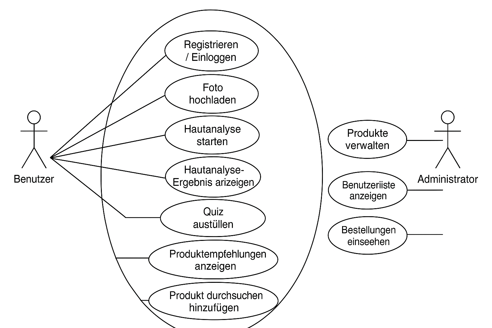
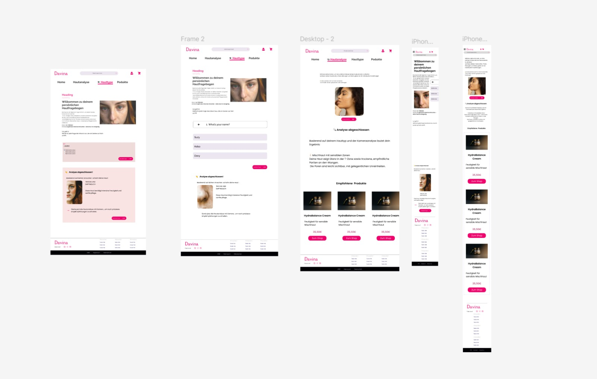
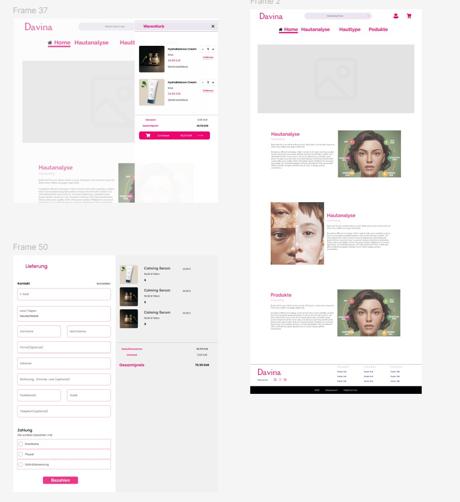
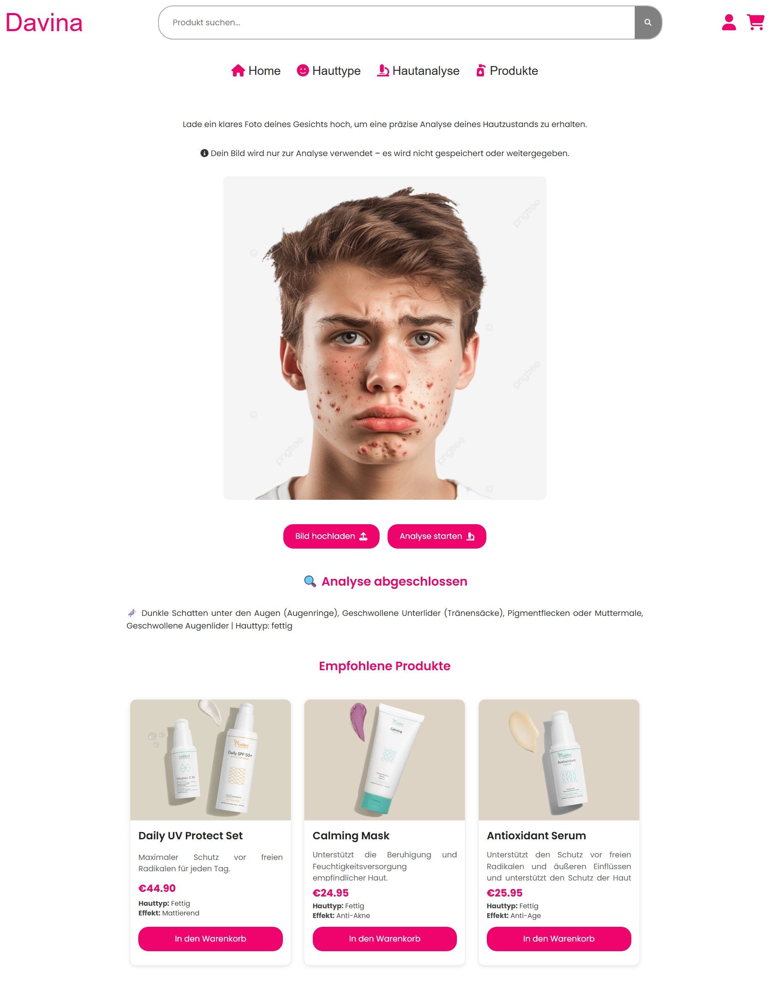
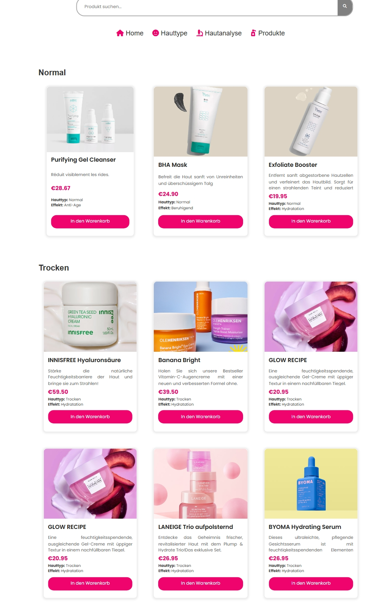
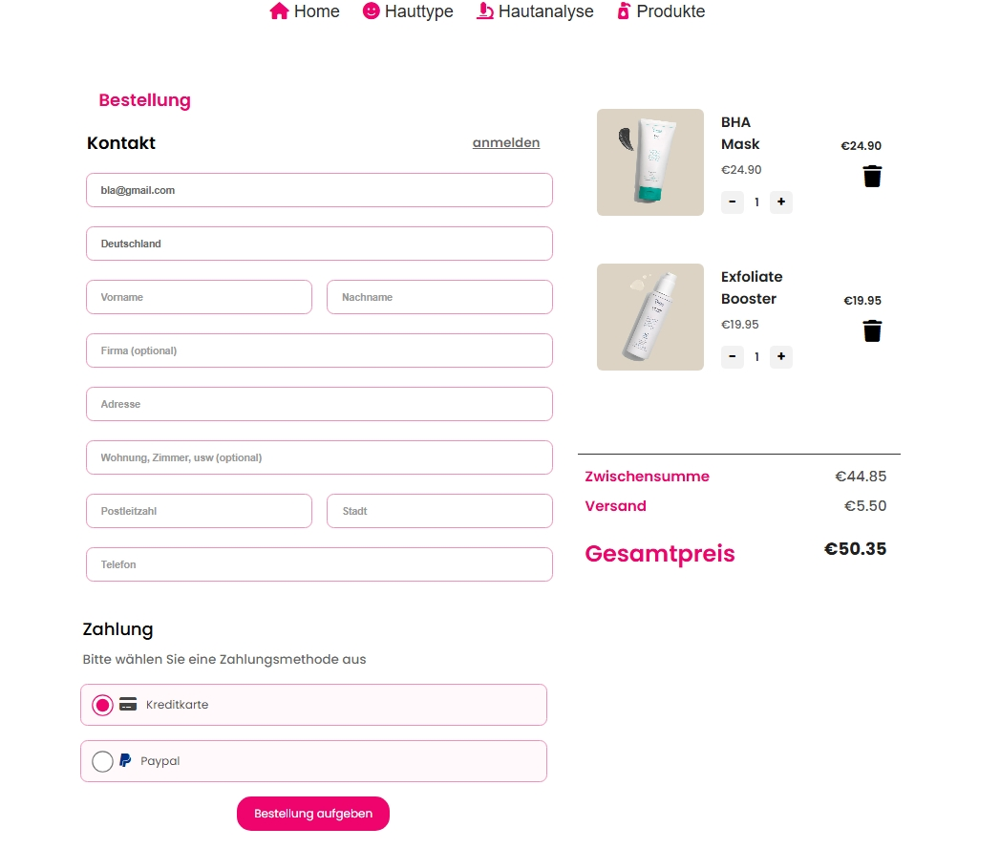
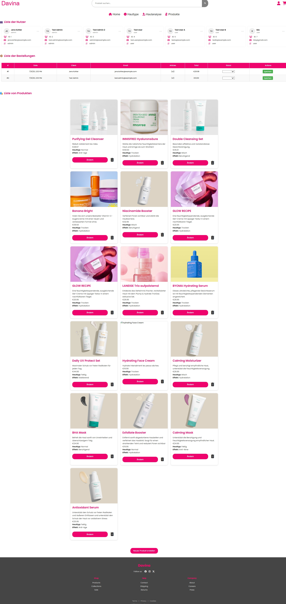

# 🧴 Skincare Fullstack Web Application (SoSe 2025)

This web application is a fullstack project in the area of e-commerce and skincare. The platform allows users to purchase skincare products and perform a personalized skin analysis. The analysis is based on an uploaded photo, which uses an algorithm to detect skin impurities (e.g., acne, redness, dryness). Matching products are then recommended.

In addition to the analysis, the platform offers a classic online shop where users can discover, add to cart, and purchase additional products.

## 🚀 Goal

Development of a modern and interactive web application that combines two core features:

1. A **personalized skin analysis** based on image processing that delivers targeted product recommendations.
2. A **functional web shop** where users can discover, select, and purchase skincare products.
3. A **skin type quiz** that determines the skin type by evaluating the user's answers.

The project places special emphasis on:

- a clear separation between frontend and backend (Clean Architecture),
- a smooth user experience (UX),
- and the use of modern technologies such as TypeScript, Angular, Docker, API, and JWT.

---

## 🧩 Features (User Stories)

### 👤 As an anonymous user

- As an anonymous user, I want to register and log in so I can access personalized features.

### 🧑‍💻 As a logged-in user

- As a logged-in user, I want to upload a photo of my face so my skin can be analyzed.
- As a logged-in user, I want to see the analysis results with clear recommendations so I can select products accordingly.
- As a logged-in user, I want to add recommended products directly to my cart so I can purchase them later.
- As a logged-in user, I want to browse and add other products to my cart.
- As a logged-in user, I want to manage my cart (add, remove, change quantity) so I can adjust my order.
- As a logged-in user, I want to complete an order and pay so I receive the desired products.
- As a logged-in user, I want to fill out a skin type quiz so my skin type is automatically determined.

### 🔐 As an Administrator

- As an admin, I want to create, edit, and delete products so the catalog stays up to date.
- As an admin, I want to view the user list to manage the platform.
- As an admin, I want to view orders and payments to keep track of shop operations.

---

## Installing node modules in Backend 

Run npm install in the backend/ folder.

## Installing and accessing web application

After cloning the repository,

run this from the root directory to start both the front- and backend:

```
docker compose up --build
```

Access web application via:

http://localhost:4200/

For Log-In Credentials check user_credentials.md

## Starting frontend test

Run this from the frontend directory to install all dependencies:

```
npm install
```

Run this to start the frontend test:

```
npm test
```

## Starting backend test

Run this from the backend directory to install all dependencies:

```
npm install sequelize
```

Run this to start the backend test:

```
npm test
```

## 🧠 Step 1: Modeling

### 📌 Use Case Diagram



---

## 📷 Product Images with imgbb

For displaying skincare product images in the application, we use the online service [imgbb](https://imgbb.com/).

### 🔄 Workflow

1. The product image is selected locally and uploaded to [imgbb.com](https://imgbb.com/).
2. After uploading, the image is digitized and stored online.
3. The service automatically generates a **public link** (e.g., `https://i.ibb.co/xyz/product-image.jpg`) that is globally accessible.
4. This link is then stored in our **database**, in a product object under the `imageUrl` field.
5. When products are fetched, this link is used to display the image in the frontend.

### 📦 Example

```json
{
  "name": "Day Cream SPF 30",
  "description": "Protects the skin from UV rays and provides moisture.",
  "price": 14.99,
  "imageUrl": "https://i.ibb.co/xyz123/daycream.jpg"
}
```

---

## 🧼 Code Style & Formatting

This project uses [Prettier](https://prettier.io/) for automatic code formatting, both in the backend and frontend.

- Configurations are located in the following files:
  - `backend/.prettierrc`
  - `frontend/.prettierrc`
- For the frontend, a special parser for Angular templates (`*.html`) was additionally configured.
- The goal is consistent, readable, and maintainable code across the entire project.

---

## Figma

### Design 1

[Figma](https://www.figma.com/design/l1hI7hAW5CqpYSgz5H3VtK/Pages?node-id=36-233&p=f&t=1BTEq4ENc5775i97-0)


### Design 2

[Figma](https://www.figma.com/design/l1hI7hAW5CqpYSgz5H3VtK/Pages?node-id=0-1&p=f&t=1BTEq4ENc5775i97-0)


## 🖼️ Screenshots

### 🏠 Home Page

<p align="center">
  
</p>

---

### 🧪 Skin Analysis – Image Evaluation

<p align="center">
  
</p>

---

### 🧴 Products

<p align="center">
  
</p>

---

### 🛒 Cart & Orders

<p align="center">
  
</p>

---

### 🛒 Admin Page

<p align="center">
  
</p>

## 📚 Official Documentation & Useful Tools

### Backend Development

| Technology     | Documentation                                       | Description                                    |
| -------------- | --------------------------------------------------- | ---------------------------------------------- |
| **Node.js**    | [Official Docs](https://nodejs.org/en/docs/)        | JavaScript runtime for server-side development |
| **TypeScript** | [TS Handbook](https://www.typescriptlang.org/docs/) | Typed JavaScript superset                      |

### Databases

| Technology     | Documentation                                 | Description                    |
| -------------- | --------------------------------------------- | ------------------------------ |
| **MongoDB**    | [MongoDB Docs](https://docs.mongodb.com/)     | Document-oriented NoSQL database |
| **PostgreSQL** | [PostgreSQL Docs](https://node-postgres.com/) | Open-source RDBMS              |

### Security

| Technology  | Documentation                                          | Description              |
| ----------- | ------------------------------------------------------ | ------------------------ |
| **bcrypt**  | [npm bcryptjs](https://www.npmjs.com/package/bcryptjs) | Password hashing library |
| **JWT**     | [jwt.io](https://jwt.io/introduction/)                 | JSON Web Tokens standard |

### Infrastructure

| Technology  | Documentation                            | Description        |
| ----------- | ---------------------------------------- | ------------------ |
| **Docker**  | [Docker Docs](https://docs.docker.com/)  | Container platform |

### Frontend

| Technology  | Documentation                            | Description               |
| ----------- | ---------------------------------------- | ------------------------- |
| **Angular** | [Angular Docs](https://angular.io/docs)  | Web Application Framework |

### Project Documentation

| Tool          | Documentation                                    | Description                        |
| ------------- | ------------------------------------------------ | ---------------------------------- |
| **README.md** | [Markdown Guide](https://www.markdownguide.org/) | Standard for project documentation |
